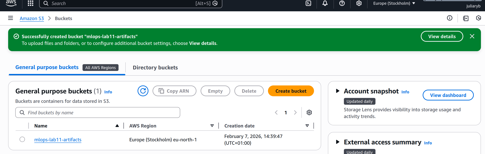
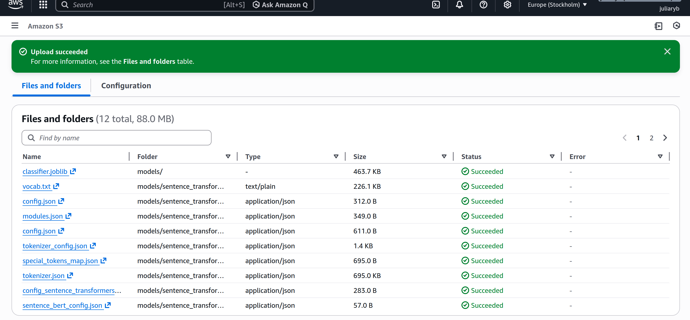

# Lab 11 - 

## Preparing our first GitHub Actions workflow

## Exploring GitHub Actions features
- workflow contains jobs, job consists of steps
- workflows are triggered by events
- jobs run inside the workflow, independently (in parallel) or with defined dependencies
- steps are specific commands, executed sequentially, that do the actual work in jobs

### Events 
- specific activities in a repository that can automatically start (trigger) workflows
- e.g. pushing commits, opening a PR, or adding a Git tag
- defined using the `on` key in workflow definition

### Contexts 
- used to access dynamic or configured values in workflows
- e.g. repository or event information (`github`), environment variables (`env`), user-provided inputs (`inputs`), or centrally managed configuration (`vars`)
    - `github` context is used to get information about repository, event, or workflow run itself
    - `inputs` context gets values provided by the user or another workflow as input configuration
    - `env` context is used to store and reuse configuration values across steps, jobs, or entire workflows
    - `vars` context are used for non-sensitive environment variables configuration values that you want to reuse, e.g. base URLs for services
    - `secrets` context is used for sensitive data that must be kept secure and not shown in logs, e.g. API keys or access codes

## Project Setup 

**lost access to Learner Lab here...** further tasks will be performed on a private AWS account

- created an S3 bucket and added the models
    
    

